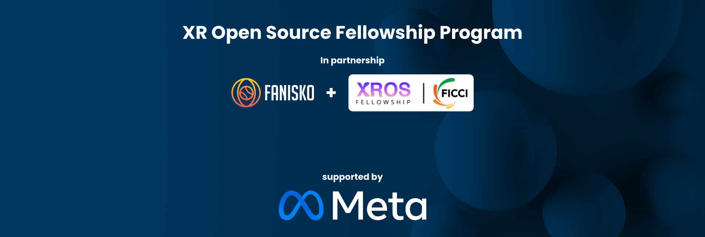
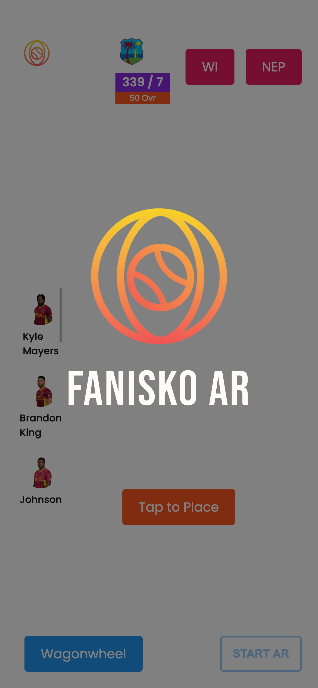

# 3D simulated Live match in AR with interaction

## Table of Contents

1. [Introduction](#1-introduction)
2. [Project Journey](#2-project-journey)

   - [Inception of the Idea](#inception-of-the-idea)
   - [Research and Planning](#research-and-planning)
   - [Technology Stack Selection](#technology-stack-selection)

3. [Setting Up the Project](#3-setting-up-the-project)
   - [System Requirements](#system-requirements)
   - [Installation Instructions](#installation-instructions)
   - [Configuration Steps](#configuration-steps)
   - [Dependencies and Libraries Used](#dependencies-and-libraries-used)
4. [Creating AR Filters](#4-creating-ar-filters)
   - [Overview of AR Filter Development](#overview-of-ar-filter-development)
   - [Initial Approach: MindAR](#initial-approach-mindar)
     - [Pros and Cons](#pros-and-cons)
     - [Challenges Faced](#challenges-faced)
   - [Transition to Custom AR Solution](#transition-to-custom-ar-solution)
     - [Introduction to Face-api.js and HTML Canvas](#introduction-to-face-apijs-and-html-canvas)
     - [Leveraging Machine Learning with Face-api.js](#leveraging-machine-learning-with-face-apijs)
     - [Applying Filters on Detected Faces](#applying-filters-on-detected-faces)
5. [WebRTC Integration and Streaming](#5-webrtc-integration-and-streaming)
   - [Understanding WebRTC](#understanding-webrtc)
   - [Real-time Communication with WebRTC](#real-time-communication-with-webrtc)
6. [Key Features and Functionality](#6-key-features-and-functionality)

   - [Enhancing the Live Streaming Experience](#enhancing-the-live-streaming-experience)
   - [User Engagement and Interaction](#user-engagement-and-interaction)

7. [Current Project Stage and Known Issues](#7-current-project-stage-and-known-issues)
   - [Summary of the Current Project Stage](#summary-of-the-current-project-stage)
   - [Evaluation of Project Progress](#evaluation-of-project-progress)
   - [Identified Issues and Limitations](#identified-issues-and-limitations)
   - [Proposed Solutions and Future Improvements](#proposed-solutions-and-future-improvements)
8. [Conclusion](#8-conclusion)

---

## 1. Introduction

<!--  -->

 

3D simulated live match in AR with Interaction - Open Source Project
3D simulated live match in AR with Interaction is an open-source project aimed at creating an interacrive platform with augmented reality (AR) features such as 3D rendering and Ground Plane Tracking. It provides users with online Web Based Augmented Reality options including a dynamic 3D WagonWheel in the form of immersive AR experience. The project leverages web technologies such as HTML, Three.js, WebXR, A-Frame, VanillaJS etc.

## 2. Project Journey

### Inception of the Idea

This open-source project was developed as a part of the XROS Fellowship under the Fanisko organization. The goal of the project was to create a live AR experience out of live data platform with augmented reality (AR) features. By incorporating AR technology, the AR platform aims to provide an immersive and interactive viewing experience for users during live game events.

### Research and Planning

The research and planning phase played a crucial role in shaping the direction and implementation of this AR project. Extensive research was conducted to explore existing AR platforms, plane tracking, data fetching technologies, and DOM Overlaying protocols. This section outlines the key milestones and dates during the research and planning phase.

| Milestone               | Date       |
| ----------------------- | ---------- |
| Research kick-off       | 2022-05-01 |
| AR platform analysis    | 2022-05-15 |
| Fetching tech research  | 2022-06-01 |
| Bug Fixing              | 2022-06-15 |
| UI Improvements         | 2022-07-01 |

During the research kick-off, the project team gathered to discuss the objectives and scope of the project. The primary focus was on understanding the capabilities and limitations of existing AR platforms and identifying the most suitable options for integrating AR into the watch party platform.

The subsequent milestone involved an in-depth analysis of various AR platforms available in the market. Factors such as ease of integration, performance, and community support were considered during the evaluation process. This research helped the team make an informed decision regarding the selection of the WebXR for the project.

Simultaneously, research was conducted on data fetching technologies to identify the best approach for real-time data fetching through live APIs. Different methods, including Axios and Node based, were studied, and their suitability for live data fetching applications was assessed. This research helped the team gain a deeper understanding of the technical requirements and challenges associated with streaming in the context of the AR project.

Following the research phase, planning and strategy development commenced. The team analyzed the gathered insights, identified project requirements, and formulated a roadmap for the development process. The planning phase involved setting project milestones, allocating resources, and outlining the steps needed to bring the Fanisko Watchparty AR project to fruition.

The research and planning phase provided a solid foundation for the subsequent stages of the project, guiding the technology stack selection, development approach, and implementation strategies. The insights gained during this phase were instrumental in ensuring the successful integration of augmented reality, data fetching capabilities, and real-time data viualisation on AR platform.

### Technology Stack 

<!--  -->

<!--  -->

## 3. Setting Up the Project

### System Requirements

To set up the Fanisko Watchparty AR project, ensure that your system meets the following requirements:

- **Operating System:** AndroidOS, iOS(Safari Beta)[Will be accessible to all iOS devices from iOS16]
- **Processor:** Snapdragon 685 or above preffered
- **RAM:** 8GB or higher
- **Storage:** 128GB of available space
- **Browser Compatibility:**
  - Google Chrome (latest version)
  - Mozilla Firefox (latest version)
  - Safari (beta version)
- **Internet Connection:** Stable broadband connection with a minimum speed of 5 Mbps

Please note that these are the recommended system requirements. The project may still work on lower specifications, but performance may be affected.

## Dependencies and Libraries Used

| Dependency/Library | Purpose                                            |
| ------------------ | -------------------------------------------------- |
| HTML               | For building user interfaces                       |
| Three.js           | JavaScript 3D library for rendering 3D graphics    |
| Zappar             | AR development platform                            |
| A-Frame            | Web framework for building virtual reality (VR)    |
| VanillaJS          | JavaScript framework for client-side development   |
| TypeScript         | Typed superset of JavaScript for improved IDE      |

## 6. Key Features and Functionality

#### Enhancing the Live User Experience

#### User Engagement and Interaction

## 7. Current Project Stage and Known Issues

### Summary of the Current Project Stage

Overall, the project is in an advanced stage, with the core functionalities implemented successfully. However, there are still areas for improvement and fine-tuning to provide a seamless and immersive AR-powered cricketing experience.

### Identified Issues and Limitations

#### Issue: Broken API endpoint

### Proposed Solutions and Future Improvements

To address the identified issues and limitations, proposed solutions and future improvements have been outlined. These include optimizing AR Hit-test performance, improving compatibility across different platforms, and enhancing the stability and scalability of the AR functionality. Additionally, continuous testing, user feedback, and iterative development will be key to refining the project further.

## 8. Conclusion

### Creators

The "3D simulated Live match in AR with interaction" project was created by:

- 
 Ayesha 

- 
 Vasu 

### Project Mentor

- 
 Pugazhenthi Ramakrishan 

- 
 Harshaanthan Siva 

### Organization

Fanisko

For more information, visit the [XROS Fellowship website](https://xrosfellowship.org/).

### License

This project is open-source and is licensed under the [MIT License](LICENSE).
